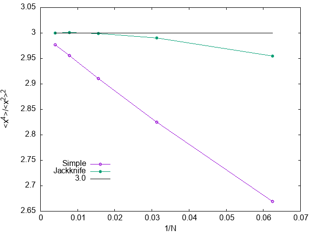

# Sample Code of Jackknife Resampling Method

## Summary

Samples codes of Jackknife resampling written Python and C++.

## Python Sample

[](https://colab.research.google.com/github/kaityo256/jackknife/blob/main/Jackknife.ipynb)

A sample of the [jackknife resampling method](https://en.wikipedia.org/wiki/Jackknife_resampling). You can try it at Google Colaboratory.

[Open Jupyter Notebook at Google Colaboratory](https://colab.research.google.com/github/kaityo256/jackknife/blob/main/Jackknife.ipynb).

## C++ Sample

Suppose x is a random variable which obeys the normal distribution. We want to estimate the following three quantities.

1. 1 / <x^2> = 1
2. <x^4> / <x^2>^2 = 3
3. <x^4> / <x^4> / <x^2> = 5

We draw N samples of x and calculate the above by the simple estimator and the jackknife estimator.

```sh
$ cd cpp_sample
$ make
$ ./a.out
# 1/<x^2>^2
# N Simple Jackknife
16 1.51869 0.698428
32 1.22236 0.961052
64 1.10196 0.99217
128 1.04755 0.996782
256 1.02372 0.999382

# <x^4>/<x^2>^2
# N Simple Jackknife
16 2.6653 2.95108
32 2.82461 2.98959
64 2.9144 3.00326
128 2.95561 3.00139
256 2.97643 2.99948

# <x^6>/<x^4>/<x^2>
# N Simple Jackknife
16 3.60584 4.33516
32 4.10826 4.6924
64 4.46217 4.86671
128 4.69751 4.95426
256 4.83132 4.97858
```

You can see that the results by the simple estimator exhibit apparent 1/N dependence, while those by the jackknife estimator are improved.

With gnuplot, you can visualize the above results.

```sh
gnuplot test.plt
```





## License

[MIT](LICENSE)
